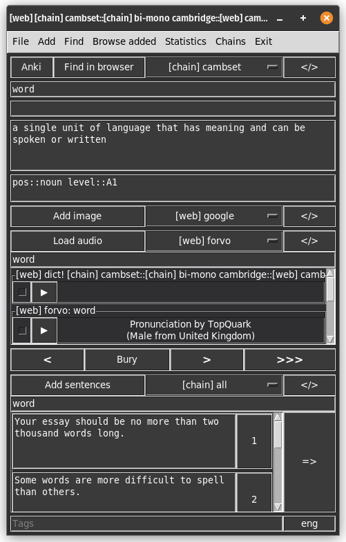
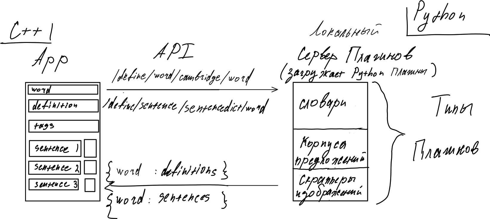
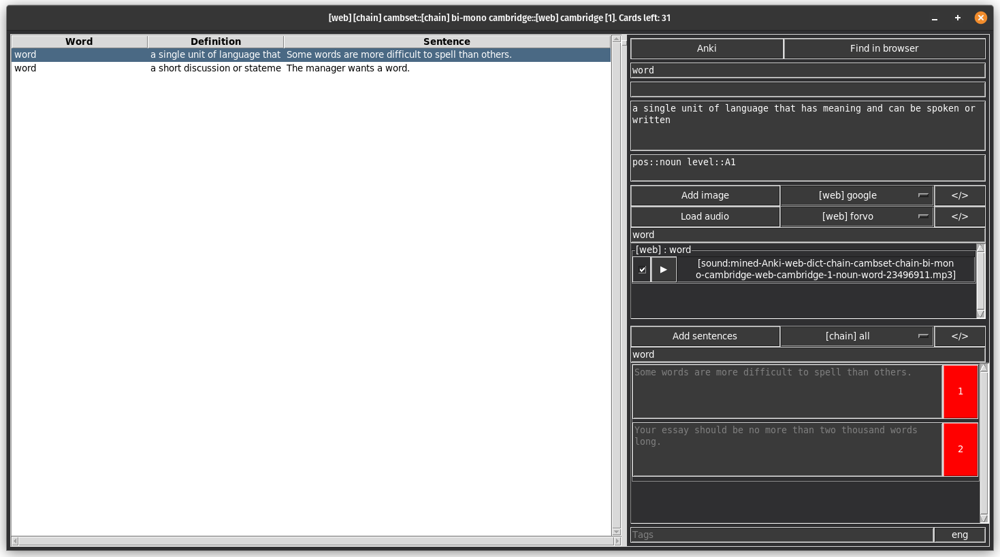

## Микрообзор функционала Dict2Flashcards
Лучше посмотреть [страничку на гитхабе](https://github.com/Blackdeer1524/Dict2Flashcards).

## Навигация по колоде 

Приложение является "визуализацией" коллекиции Deck. Deck - это по сути вектор 
карточек (класс Card). Кнопки со стрелками - навигация по колоде. ">" 
пропустить карточку, "<" откатиться к предыдущей карточке 
(и убрать карточку из добавленных если она была добавлена на предыдущем шаге). 
">>>" - пропустить все оставшиеся карточки в колоде. Bury - отложить 
карточку в отдельный файл.

Внутри у нас 2 колоды: колода, с которой мы взаимодействуем (Deck) и в которую 
идут сохраненные карточки (SaveDeck). 

## Плагины
У нас будут плагины, отвечающие за:
 * за сохранение колоды;
 * за снабжение информации
   * предоставление определений к словам
     * Локальные словари (json)
     * Внешние словари   (парсеры HTML страниц, API, и т.д. )
   * предоставление предложений по слову
     * Внешние словари   (парсеры HTML страниц, API, и т.д. )
   * предоставление ссылок изображений
     * Внешние  (парсеры HTML страниц, API, и т.д. )
   * предоставление ссылок на аулио
     * Локальные (директория с аудио)
     * Внешние   (парсеры HTML страниц, API, и т.д. )

Каждый плагин должен реализовать 3 функции:
def get(word: str) - возвращает список карт, в которых заполнены соответствующие типу плагина поля
def load() - выполняет необходимые действия при первом использовании плагина
def unload() - выполняет необходимые действия, когда плагин больше не нужен

С плагинами мы будет общаться через запросы к серверу плагинов:

Кнопки `</>` отвечают за конфигурацию плагинов

Кнопки прямо левее `</>`: кнопка выбора текущего плагина

Плагины снабжения можно **комбинировать в цепи**. Цепи нужны для одновременного
поиска по словарям / парсить несколько искочников за раз. **Цепи так же можно 
комбинировать в цепи**. Реализация комбинации цепей в цепи довольно сложна 
так как нужно управлять графом зависимостей цепей друг от друга (по этому 
цепи цепей мы оставим до самого конца, если на это будет время):

## Интерфейс добавления изображений
Существует возможность добавление к карточкам изображений

## Браузер добавленных карточек (текущая сессия) 

Основная проблема, связанная с браузером, это синхронизация плагинов снабжения
в окне браузера в основным окном. То есть если мы поменяли текущий плагин снабжения
предложений в браузере, это дожно так же отразиться в основном окне.

## Язык запросов
Реализован язык запросов который позволяет искать карточки по колоде. 
[см. стандарт](https://github.com/Blackdeer1524/Dict2Flashcards#query-language-documentation)
